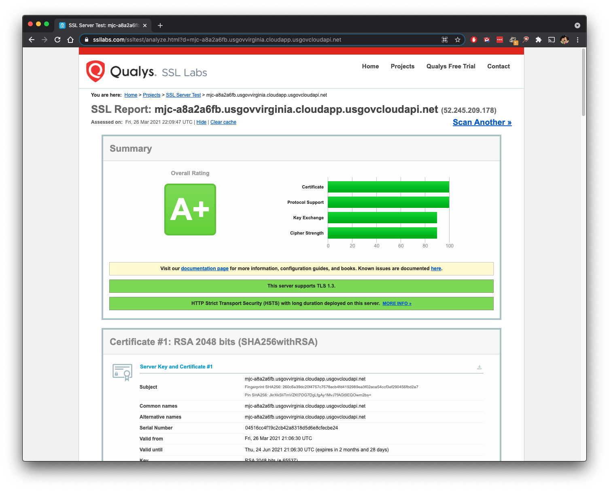

# ubuntu-hardened-host

Hardened (FIPS) Host for NGINX, Docker, Kubernetes, etc

- This will deploy a single Ubuntu 18.04 (Bionic) Instance, apply security hardening configurations, install NGINX/NGINX+, Docker, and Kubernetes.  
- Then use certbot to install valid certificate.
- Then download and scan with OpenScap, saving the results to the default index for NGINX.

- Current configs are recieving A+ on SSL Labs.


## to do

- [to do](TODO.md)

## Deployment

- Change the variables to match your requirements, example:

```hcl
variable adminUserName { default = "xadmin" }
variable adminPassword { default = "2018F5Networks!!" }
variable adminPubKey { default = "~/.ssh/id_rsa.pub" }
variable location { default = "usgovvirginia" }
variable region { default = "USGov Virginia" }
variable prefix { default = "mjc" }
...
variable region_domain { default = "usgovvirginia.cloudapp.usgovcloudapi.net" }

# https://www.open-scap.org/security-policies/choosing-policy/
variable oscap_profile { default = "https://security-metadata.canonical.com/oval/com.ubuntu.$(lsb_release -cs).usn.oval.xml.bz2" }
variable lsb_release { default = "bionic" }
...
variable tags {
  default = {
    "purpose"     = "public"
    "environment" = "env" #ex. dev/staging/prod
    "owner"       = "email@domain" # will be passed to certbot
    "group"       = "group"
    "costcenter"  = "costcenter"
    "application" = "app"
  }
}
```

```bash
terraform init
teraform plan
terraform apply
```

- Wait a few minutes for cloud-init to complete and a system reboot.
- open https://[URL] from terraform outputs.

```bash
Outputs:

secure_nginx_public_fqdn = https://random.azure.domains.com
secure_nginx_public_ip = https://XX.XX.XX.XX
```
